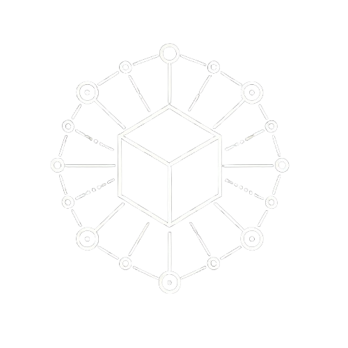

# 🔐 DecentralizedBlackbox


**DecentralizedBlackbox** is an IoT project that leverages LoRa, ESP32, and blockchain technologies (IOTA EVM and SUI) to create a decentralized "blackbox." The goal is to collect data from remote devices and notarize it on blockchain to ensure integrity, security, and transparency.

## 📂 Repository Structure

- **`firmware/`**  
  Contains the code for the ESP32 Heltec LoRa v3, responsible for collecting data and transmitting it via LoRa.
- **`deploy/`**  
  Node.js scripts for deploying smart contracts to IOTA EVM and SUI, with automatic updates to environment variables. 

- **`scripts/`**  
  - `sendTx.js`: Sends transactions to the deployed contracts. 
  - `mqttSubscriber.js`: Connects to the MQTT broker to receive real-time data. 
- **`frontend/`**  
Provides a user interface for monitoring and interacting with the system. 

- **`requirements.txt`**  
  Lists the Python dependencies required.
- **`package.json`**
  Lists of node dependencies required.

---

## ⚙️ Installation

### 1. Clone the Repository

```bash
git clone https://github.com/pyMelo/DecentralizedBlackbox.git
cd DecentralizedBlackbox
```

### 2. Install Dependencies

```bash
pip install -r requirements.txt
```

### 3. Configure the ESP32 Heltec LoRa v3

- Flash the firmware in the `firmware/` directory onto your ESP32 Heltec LoRa v3 device. Ensure that the correct board drivers are installed and that you have selected the appropriate COM port. The firmware supports multiple sensor configurations and can be tailored to your specific hardware setup.

---

## 🔑 Blockchain Configuration

### 1. Setting Up Wallets

#### **IOTA and Metamask:**
- Create a wallet and store the private key securely. The private key will be required to authenticate transactions and interact with the deployed contracts.

#### **SUI:**
1. Import your wallet:
   ```bash
   sui keytool import --alias walletkey <your_private_key> ed25519
   ```
2. Switch to the imported wallet:
   ```bash
   sui client switch --address walletkey
   ```
3. Convert the private key for backend use:
   ```bash
   sui keytool convert <private_key>
   ```
   Store this converted key in the `.env` file for seamless integration during deployment and transaction submission.

---

### 2. Setting Up the `.env` File

Create a `.env` file at the root of the project and ensure there’s a copy in the `deploy/` directory before running the deployment script. Add the following variables:

```env
# Private keys
SUI_PRIVATE_KEY=<converted_sui_private_key>
IOTA_PRIVATE_KEY=<your_metamask_private_key>

# TTN Configuration
TTN_API_KEY=<your_ttn_api_key>
```

> **Note:** After deployment, the `.env` file will automatically be updated with:

```env
IOTA_CONTRACT_ADDRESS=<iota_contract_address>
SUI_PACKAGE_ID=<sui_package_id>
```

---

## 🚀 Deployment and Execution

### 1. Deploy the Smart Contracts

From the `deploy/` directory, run:

```bash
node deploy.js
```

This step will compile the contracts, deploy them to the appropriate testnets, and store their addresses in the `.env` file for later use.

### 2. Run the Scripts

- **Send transactions to the contracts:**
  ```bash
  node sendTx.js
  ```

- **Start the MQTT subscriber:**
  ```bash
  node mqttSubscriber.js
  ```

The scripts are designed to run in a secure environment and will output status logs to help you monitor operations. For example, `mqttSubscriber.js` provides detailed logs of incoming messages, helping you quickly identify any issues in the data pipeline.

---

## 🔄 System Flow

1. **Data Collection:**  
   TThe ESP32 gathers sensor data.

2. **Transmission using LoRaWAN via TTN:**  
   TTN receives the data and forwards it to the MQTT broker. TTN integration ensures that devices can operate in low-power environments while maintaining reliable data transmission.

3. **Blockchain Notarization:**  
   The data is recorded on IOTA EVM and SUI using the deployment and transaction scripts. This step guarantees that the collected data is immutable and verifiable by any third party.

4. **Visualization and Management:**  
   A forthcoming web application will provide a graphical interface to view data, configure IoT devices, and manage blockchain interactions. This user-friendly dashboard will be instrumental in overseeing the entire system.

---

## 🌐 Web Application

The web application offers an intuitive interface for monitoring IoT devices and visualizing collected data.


### 🏠 Home Dashboard - Platform Selector


The user can navigate between SUI or IOTA depending where it's device's data are deployed to. 


The homepage also allows setting user credentials that are crucial to the decrypting part like a nickname, the vehicle ID and the initial registered device date.

### 🗝️ Daily Key Calculator


This section is all about computing the daily key for certain days to let other users watch the datas related to that day, witouth compromising the master key of the owner.

### 💻 Dashboard


SUI and IOTA Dashboard are the same. We have two options depending on our interest. 
- We can see the clear datas without using any key, just the contract delivered to the user, that is associated to the sensor.
- We can use our master/daily key to see the related encrypted datas of a certain day.

#### 📊 Clear datas

- 🌡  Temperature


In the dashboard we can see the temperature

- 🌀 Gyroscope

As well the three axis of the gyroscope 


#### 📊 Encrypted Datas

As we can see after just inserting the master key the button about showing the encrypted datas has been clickable


After clicking it (we can choose to see all the datas in the same dashboard) encrypted payloads are decrypted and being plotted.


The data encrypted shown are Accelerometer and GPS Location.

 


---

## 🤝 Contributing

Contributions, suggestions, and pull requests are welcome. If you have questions or proposals, feel free to open an issue.

---

## 📜 License

Distributed under the MIT license. See the [LICENSE](LICENSE) file for details.

---

*DecentralizedBlackbox* combines IoT, LoRa, and blockchain into an innovative solution for data acquisition and notarization.

